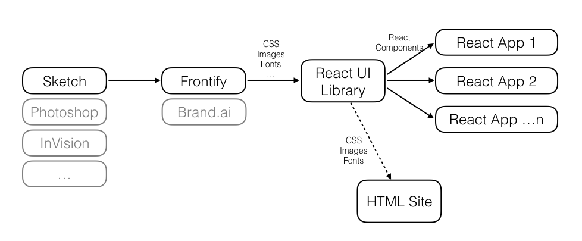

# Design System Demo Library

## What is this?

This is a demo of how integration with tools like [Frontify](http://frontify.com) or [Brand.ai](http://brand.ai/) can automate some parts of the workflow when it comes to building web apps. The demo consists of four repositories:
- [ds-demo-lib](http://github.com/buildit/ds-demo-lib): this is a React library of common components
- [ds-demo-app1](http://github.com/buildit/ds-demo-app1): a consumer app of the above library. This pretends to be some kind of banking app where a table of data is shown.
- [ds-demo-app2](http://github.com/buildit/ds-demo-app2): a second React app, consuming the common library. This has a simple form to make a "payment" of some sort.
- [ds-demo-web](http://github.com/buildit/ds-demo-web): a static HTML site which consumes the styles available in the library.

Here's what the flow looks like:



## What am I looking at

The common library has three components:
- a [header](https://github.com/buildit/ds-demo-lib/blob/master/src/header/index.jsx)
- a [footer](https://github.com/buildit/ds-demo-lib/blob/master/src/footer/index.jsx)
- a [button](https://github.com/buildit/ds-demo-lib/blob/master/src/button/index.jsx) (also used by the header)

Styling is done via [less](http://lesscss.org/). To see the component in the library run the `storybook` script. For the rest of the projects (the two apps and the static site) just run the `start` script. Open the following in a browser to see each project:
- http://localhost:9000 (library storybook)
- http://localhost:9001 (app 1)
- http://localhost:9002 (app 2)
- http://localhost:9003 (static site)

## Configuration

The library currently has the sample styles we created already in the `src/assets` diretory. The `assets` script will download any styles you have and extract them there. Obviously you will need a respective Frontify and/or Brand.ai account. You also need to create a `brandai.config.js` in the library root folder. This needs to look like this:

```
const brandai = {
  logos: <BRAND.AI ENDPOINT>,
  icons: <BRAND.AI ENDPOINT>,
  image:  <BRAND.AI ENDPOINT>,
  styles:  <BRAND.AI ENDPOINT>
};

const frontify = {
  devkit: <FRONTIFY ENDPOINT>,
  logo:  <FRONTIFY ENDPOINT>
};

exports.default = {
  brandai,
  frontify
};
```

You can adjust the above config and `assets` task in the gulp file depending how your style library is created.

## How do the styles work?

There are three main styles files in `src`:
- vanilla.less
- taco-bank.less
- unicorn-inc.less

There is also a sample styleguide in `sample.less`.
Each of the less files provides a mapping to the styles imported from the various tools. The vanilla one is actually hardcoded values, to demonstrate how that is another option. The idea is that as a developer of a consumer app you only have to worry about the names defined in the style files. These then map them to whatever the various design tools export.

## What about the static site

That is there to demo that the styles can easily be reused for a static site, not just React apps. In fact, the styles can be used by anything that understands less. Note that the choice of less is just for this example, both Frontify and Brand.ai can export SCSS or plain CSS too.
